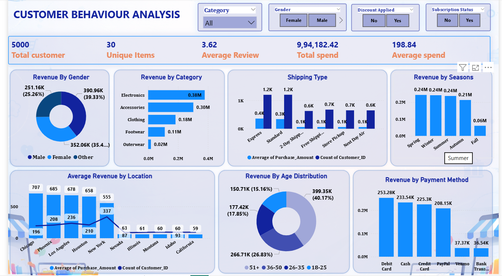

# 🛍️ Customer Behaviour Analysis Dashboard


## 🎯 Project Objective

To transform customer transaction data into an interactive Power BI dashboard and generate actionable insights related to **customer behaviour, revenue, products, and business performance**.


## 🛠️ Tech Stack

- **Python** – Data Cleaning & Exploratory Data Analysis 
- **Pandas** – Data Manipulation 
- **NumPy** – Numerical Analysis 
- **Matplotlib & Seaborn** – Data Visualization 
- **SQL** – Data Analysis & Customer Insights 
- **Power BI** – Interactive Dashboard & Reporting 
- **DAX** – Measures & Calculations 
- **Power Query** – Data Transformation

---
## 📂 Project Structure
```text
Customer-Shopping-Behavior-Analysis/
│
├── DATA/
│   ├── Customer_Shopping_Behaviour.csv
│   └── Customer_Shopping_Clean_Data.csv
│
├── Data_Cleaning/
│   └── Customer_Shopping_Data_Cleaning.ipynb
│
├── EDA/
│   └── Customer_Shopping_EDA.ipynb
│
├── SQL/
│   └── Customer_Shopping_SQL_Analysis.sql
│
├── PowerBI/
│   └── Customer_Shopping_Behaviour_PowerBI.pbix
│
├── Images/
│   ├── Customer_Analysis.png
│   ├── Product_Location_Analysis.png
│   └── PowerBI_Dashboard.png
│
├── Report/
│   └── Customer_Behaviour_Analysis_Report.pdf
│
└── README.md
```


## 🔄 Data Pipeline

1. **Raw Data Collection** – Collected customer shopping behavior data containing customer, product, purchase, and demographic information.

2. **Data Cleaning** – Handled missing values, corrected data types, removed inconsistencies, and prepared the dataset for analysis.

3. **Exploratory Data Analysis (EDA)** – Analyzed customer behavior, purchasing patterns, product trends, and key relationships using Python.

4. **SQL Analysis** – Used SQL queries to generate customer insights, sales metrics, rankings, and business-focused analysis.

5. **Power BI Dashboard** – Built an interactive dashboard with KPIs, charts, filters, and customer/product insights.

6. **Business Insights** – Converted analytical findings into actionable insights to understand customer preferences and purchasing behavior.
   
## 📊 Dashboard Pages

### 1. Customer Behaviour Analysis

[](./image/Customer_Analysis.png)

Provides an overall view of customer purchasing behaviour and spending patterns.

**Key KPIs:**
- Total Customers: **5,000**
- Unique Items: **30**
- Average Review: **3.62**
- Total Spend: **₹9.94 Lakh**
- Average Spend: **₹198.84**

**Key Visuals:**
- Revenue by Gender
- Revenue by Category
- Shipping Type
- Revenue by Season
- Average Revenue by Location
- Revenue by Age Distribution
- Revenue by Payment Method

**Filters:**
- Category
- Gender
- Discount Applied
- Subscription Status

---

### 2. Product & Location Analysis

[](./image/Product%20%26%20Location%20Analysis.png)

Focuses on identifying the best and worst-performing products and locations.

**Key Visuals:**
- Top 5 Items by Average Rating
- Top 5 Items by Revenue
- Top 5 Locations by Revenue
- Bottom 5 Items by Average Rating
- Low Revenue Products
- Bottom 5 Locations by Revenue
  
## 💡 Key Insights

- **5,000 customers** and **30 unique items** were analyzed, with total customer spending of **₹9.94 lakh**.
- **Electronics** generated the highest category revenue at approximately **₹0.38M**, followed by Accessories and Clothing.
- **Male customers** contributed the highest revenue at approximately **₹390.96K**, followed by Female and Other customers.
- **Headphones** generated the highest product revenue at approximately **₹138K**, followed by Phone, Bag, Laptop, and Watch.
- **New York** recorded the highest revenue among locations at approximately **₹187.12K**.
- **Jewelry** achieved the highest average rating of **3.8**, while Phone recorded the lowest rating among the analyzed products at **2.9**.
- **Debit Card** was the highest revenue-generating payment method at approximately **₹253.28K**.
- **Spring, Winter, and Summer** recorded the highest seasonal revenue at approximately **₹0.24M** each.
- **Standard and Express** shipping types recorded the highest customer counts.
- **Hoodie, Backpack, Sneakers, Gloves, and Jeans** were identified as low-revenue products.
- **Rhode Island, New Jersey, Florida, Hawaii, and Kansas** were among the lowest-revenue locations.
- The dashboard helps identify **customer preferences, product performance, revenue trends, and areas for business improvement**.
